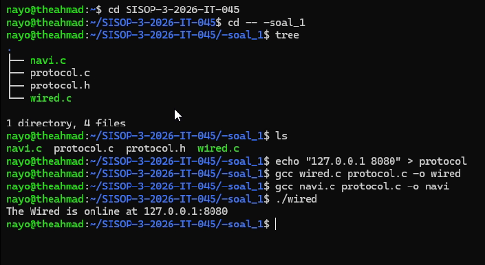
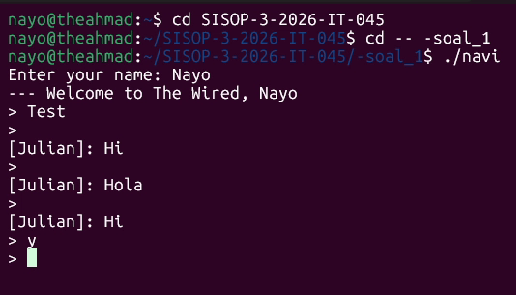
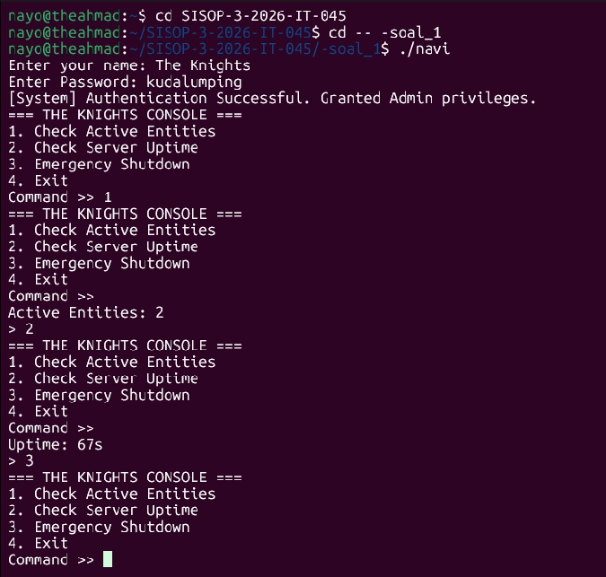

# SISOP-3-2026-IT-045
#### 5027251045 - Ahmad Nayottama Juliansyah - Sistem Operasi (B)


### Soal 1: Present Day, Present Time
---
#### Deskripsi Soal
Pada studi kasus ini, dikisahkan bahwa dunia nyata tidak lagi mencukupi kebutuhan interaksi bagi karakter Lain Iwakura. Oleh karena itu, dikembangkan sebuah sistem komunikasi digital bernama The Wired, yaitu jaringan yang menghubungkan berbagai entitas (user) dalam suatu ruang komunikasi kolektif.

Permasalahan utama dalam pengembangan sistem ini adalah bagaimana membangun protokol komunikasi yang mampu:

- Menghubungkan banyak klien secara bersamaan

- Menjaga stabilitas koneksi

- Mendukung komunikasi real-time

- Memastikan identitas unik setiap pengguna

- Menyediakan kontrol administratif

- Mencatat seluruh aktivitas sistem


Secara rinci, kebutuhan sistem mencakup:

- Koneksi awal menggunakan IP dan port dari file konfigurasi

- Klien mampu menerima dan mengirim data secara asynchronous

- Server mampu menangani banyak klien secara bersamaan

- Setiap klien memiliki identitas unik

- Sistem mendukung broadcast komunikasi

- Tersedia fitur administratif (RPC) untuk monitoring dan kontrol server

- Semua aktivitas dicatat dalam sistem logging permanen

Untuk memenuhi kebutuhan tersebut, dibuatlah sistem berbasis client-server menggunakan bahasa C dengan komunikasi socket.

---
#### Langkah Penyelesaian
Sistem dibangun menggunakan arsitektur:

- Server (wired.c) → pusat komunikasi

- Client (navi.c) → entitas pengguna

- Protocol (protocol.h & protocol.c) → pengelolaan konfigurasi jaringan


Komunikasi menggunakan:

- TCP Socket (AF_INET, SOCK_STREAM)

- Mekanisme multiplexing (select) untuk menangani banyak klien

- Threading (pthread) pada client untuk asynchronous input/output

---
#### Penjelasan Code

##### Koneksi Awal Melalui File Protokol
```int read_config(const char *filename, char *ip, int *port);```
- File protocol berisi IP dan port
- Fungsi read_config() membaca konfigurasi tersebut
- Digunakan oleh server dan client

##### Komunikasi Asynchronous (Client)
``` pthread_create(&recv_thread, NULL, receive_handler, NULL); ```
- Thread digunakan untuk menerima pesan
- Input user tetap berjalan di main thread

##### Server Multi-client dan Skalabilitas
``` select(max_sd + 1, &readfds, NULL, NULL, NULL); ```
- Menggunakan select() untuk menangani banyak socket
- Array clients[MAX_CLIENTS] menyimpan data klien

##### Identitas Unik Klien
``` if (strcmp(clients[j].name, buffer) == 0) ```
- Mencegah duplikasi identitas
- Jika nama sudah ada → kirim "EXISTS"
- Jika valid → kirim "OK"

##### Broadcast Komunikasi
``` void broadcast(char *message, int sender_fd); ```
- Setiap pesan diteruskan ke seluruh jaringan
- Mewujudkan komunikasi kolektif

##### Fitur Administratif (RPC System)
``` #define ADMIN_USERNAME "The Knights" #define ADMIN_PASSWORD "kudalumping" ```
- RPC_GET_USERS → jumlah user aktif
- RPC_GET_UPTIME → waktu aktif server
- RPC_SHUTDOWN → mematikan server

##### Sistem Logging
``` void write_log(const char *category, const char *msg); ```
- Semua aktivitas dicatat di history.log

#### Penjelasan Code Utama
##### navi.c
- Input username
- Validasi identitas
- Mode user biasa & admin
- Thread untuk menerima pesan
##### wired.c
- Membuka socket server
- Menerima koneksi
- Mengelola klien
- Broadcast pesan
- Menangani admin RPC
- Logging
##### protocol.c/h
- Mendefinisikan konstanta
- Membaca file konfigurasi
- Menyederhanakan reuse kode

---
#### Output






---
#### Kendala
Pembacaan Input yang Terpotong (Masalah Spasi), Saat mencoba login sebagai "The Knights", program awalnya tidak meminta password dan langsung masuk sebagai user biasa.

- Masalah: Penggunaan scanf("%s", ...) hanya membaca satu kata hingga menemukan spasi. Jadi, program hanya membaca "The" dan gagal mencocokkan dengan identitas admin.

- Solusi: Mengganti metode pembacaan input menjadi format yang mendukung spasi (seperti  %[^\n]) agar nama lengkap admin bisa terdeteksi secara utuh.


